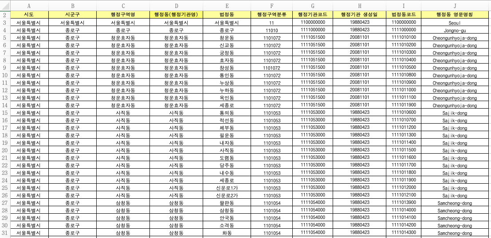

# Introduction
대한민국 행정구역분류에 따라, 각 시군구, 동별 행정구역분류코드와 행정기관코드, 법정동코드가 존재한다.

KoRegionCodeMapper 라이브러리는 행정기관코드<->행정구역분류코드 등 데이터 간의 매핑 인터페이스를 제공한다.

**For Ruby**

[ko_region_code_mapper](https://rubygems.org/gems/ko_region_code_mapper)

## Dataset

(2018.12.31 기준 데이터 base)




# Import
- bash를 통해서 설치
```bash
gem install ko_region_code_mapper
```

- (rails일 경우) Gemfile에 명시
```ruby
# Gemfile
gem 'ko_region_code_mapper', git: 'https://github.com/aria-grande/KoRegionCodeMapper.git'
```

# Features

## 행정구역코드로 시군구코드 값 찾기
시군구코드는 행정동코드의 앞의 다섯자리이다.

```ruby
mapper = KoRegionCodeMapper.new
mapper.find_sigungu_code_by_hcode('1126062000') # "11070"
```

## 시군구코드(5자리)로 행정구역코드 값 찾기

```ruby
mapper = KoRegionCodeMapper.new
mapper.find_hcodes_by_sigungu_code('11070') # ["1126000000", "1126052000", "1126054000", ..., "1126068000", "1126069000"]
```

### Usage

#### Kibana

[Kibana 한국 지역 지도](https://maps.elastic.co/#file/south_korea_municipalities)에서는 시군구코드(`sigungu_code`)를 이용하여 데이터를 맵핑한다. 내 서비스의 데이터에서는 행정기관코드를 가지고 있을 경우, 해당 라이브러리를 통해 시군구코드 값을 가져올 수 있다.


# Issues

이슈와 의견은 [깃헙 issue](https://github.com/aria-grande/KoRegionCodeMapper/issues)를 통해 생성 해주세요!
